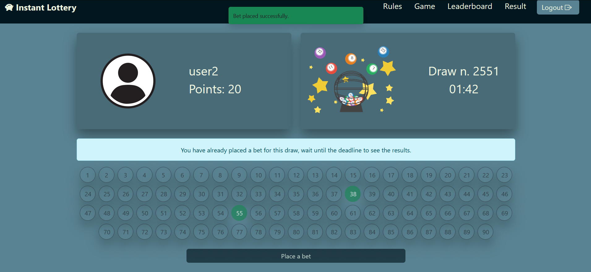
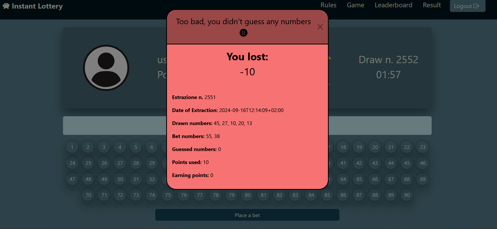

[](https://classroom.github.com/a/HF0PzDJs)

# Exam #N: "Lotto Instantaneo"

## Student: s333304 SCALERA DOMENICO

## React Client Application Routes

- **Route `/`**: Homepage dell'applicazione, permette di visulaizzare le regole del gioco. Se l'utente è loggato fornisce un messaggio di benvenuto specificando il nome dell'utente loggato
- **Route `/lottery`**: Pagina principale del gioco. Permette di selezionare tre numeri tra 1 e 90 e piazzare una scommessa, mostrando l'ID dell'estrazione e un timer. Include meccanismi per prevenire abusi, come disabilitare la griglia numerica e il pulsante di puntata in base allo stato della scommessa e al punteggio dell'utente inoltre presenta un modal che appare per mostare i risulati di una puntata a termine estrazione.
- **Route `/leaderboard`**: Pagina per la classifica, permette di visualizzare i 3 utenti che hanno ottenuto il punteggio più alto nel gioco.
**Route `/drawresult`**: Pagina per visualizzare i risulati delle estrazioni precedenti. In particolare per ogni giocata viene visualizzato:
  - Id estrazione.
  - Data estrazione.
  - Numeri puntati.
  - Numeri estratti.
  - Numeri indovinati.
  - Punti utlizzati.
  - Punti vinti.
- **Route `/login`**: La pagina di accesso permette agli utenti di autenticarsi tramite il loro username o email e la password. Presenta un form per l'inserimento delle credenziali e un pulsante per confermare il login.
- **Route `*`**:Questa rotta gestisce le URL non riconosciute, mostrando un messaggio di errore sotto forma di un'immagine (PNG) per informare l'utente che la pagina cercata non esiste.

## API Server

### Gestione dell'autenticazione degli utenti

#### Login

- metodo HTTP: `POST`  URL: `/api/sessions`
- Descriizione: autentica l'utente che sta cercando di effettuare il login
- Parametri della richiesta: Nessuno.
- Corpo della richiesta: credenziali dell'utente che sta effettuando il login(username può contenere sia lo username che la password)

    ```json
      {
        "username": "user1",
        "password": "user1"
       }
    ```

- Response: `200 OK`
- Corpo della risposta:

  ```json
     {
    "id": 1,
    "username": "user1",
    "email": "user1@polito.it",
    "points": 100
    }
    ```

- Risposte di errore:
  - `401 Unauthorized`(login fallito)
  - `500 Internal Server Error`(errore generico)

#### Controllo se l'utente è loggato

- metodo HTTP: `GET`  URL: `/api/sessions/current`
- Descriizione: controlla se l'utente è loggato e prende i sui dati
- Parametri della richiesta: Nessuno.
- Corpo della richiesta: Nessuno.
- Response: `200 OK`
- Corpo della risposta:

  ```json
     {
    "id": 1,
    "username": "user1",
    "email": "user1@polito.it",
    "points": 100
    }
    ```

- Risposte di errore:
  - `401 Unauthorized`(Utente non loggato)
  - `500 Internal Server Error`(errore generico)

#### Logout

- metodo HTTP: `DELETE`  URL: `/api/sessions/current`
- Descriizione: logout dell'utente corrente
- Parametri della richiesta: Nessuno.
- Corpo della richiesta: Nessuno.
- Response: `200 OK`
- Corpo della risposta: Nessuno.
- Risposte di errore:
  - `401 Unauthorized`(Utente non loggato)
  - `500 Internal Server Error`(errore generico)
  
### Gestione Estrazioni

#### Prendi l'estrazione in corso

- metodo HTTP: `GET`  URL: `/api/draw`
- Descriizione: Prendi le informazioni relative all'estraione in corso
- Parametri della richiesta: Nessuno.
- Corpo della richiesta: Nessuno.
- Response: `200 OK`
- Corpo della risposta:

```json
{
    "id": 2317,
    "draw_date": "2024-09-15T19:27:03+02:00"
}
```

- Risposte di errore:
  - `401 Unauthorized`(Utente non loggato)
  - `404 Not Found`
    - Messaggio di errore: no draws available.
  - `500 Internal Server Error`(errore generico)

#### Prendi i risulati di un estrazione per un utente specifico

- metodo HTTP: `GET`  URL: `/api/draw/result/:drawId`
- Descriizione: Calcola il risultato di un sorteggio per un utente  specifico
- Parametri della richiesta: drawId.(id della richiesta)
- Corpo della richiesta: Nessuno.
- Response: `200 OK`
- Corpo della risposta:

```json
{
    "draw_id": "2",
    "draw_date": "2024-09-15T19:47:03+02:00",
    "draw_numbers": [
        17,
        29,
        58,
        82,
        48
    ],
    "bet_numbers": [
        3,
        5
    ],
    "points_used": 10,
    "points_earnd": 0,
    "total_win": -10
}
```

- Risposte di errore:
  - `401 Unauthorized`(Utente non loggato)
  - `422 Unprocessable Entity`(input invalido)
  - `404 Not Found`
    - Messaggio di errore: Bet or draw not found.
  - `400 Bad Request`
    - Messaggii di errore: The extraction is not finished yet.
  - `500 Internal Server Error`(errore generico)

### Gestione Puntate

#### Piazza una puntata


- metodo HTTP: `POST`  URL: `/api/bet`
- Descriizione: Piazza una puntata sull'estrazione in corso
- Parametri della richiesta: Nessuno.
- Corpo della richiesta: 
```json
{
    "draw_id": 2,
    "numbers":[3,5]
}
```

- Response: `200 OK`
- Corpo della risposta:

```json
{
    "message": "Bet placed successfully."
}
```

- Risposte di errore:
  - `401 Unauthorized`(Utente non loggato)
  - `422 Unprocessable Entity`(input invalido)
  - `404 Not Found`
    - Messaggio di errore: Draw not found.
  - `400 Bad Request`
    - Messaggii di errore: 
      - The extraction is not finished yet.
      - Cannot bet on a completed draw.
      - You have already placed a bet for this draw.
      - Not enough points to place this bet.
  - `500 Internal Server Error`(errore generico)

#### Prendi puntata

- metodo HTTP: `GET`  URL: `/api/bet/:drawId`
- Descriizione:  Prendi la puntata dell'utente loggato per una specifica estrazione
- Parametri della richiesta: drawId.(id della richiesta)
- Corpo della richiesta: Nessuno.
- Response: `200 OK`
- Corpo della risposta:

```json
{
    "id": 227,
    "number_0": 3,
    "number_1": 5,
    "number_2": 0
}
```

- Risposte di errore:
  - `401 Unauthorized`(Utente non loggato)
  - `422 Unprocessable Entity`(input invalido)
  - `404 Not Found`
    - Messaggio di errore: Bet not found.
  - `500 Internal Server Error`(errore generico)


### Gestione Classifica

#### Prendi top tre utenti

- metodo HTTP: `GET`  URL: `/api/top-user`
- Descriizione: Prendi informazioni relative hai primi 3 utenti con più punti
- Parametri della richiesta: Nessuno.
- Corpo della richiesta: Nessuno.
- Response: `200 OK`
- Corpo della risposta:

```json
[
    {
        "username": "user1",
        "points": 100
    },
    {
        "username": "user2",
        "points": 45
    },
    {
        "username": "user3",
        "points": 20
    }
]
```

- Risposte di errore:
  - `401 Unauthorized`(Utente non loggato)
  - `500 Internal Server Error`(errore generico)

### Gestione Risultati

- metodo HTTP: `GET`  URL: `/api/user-results`
- Descriizione:  Prende la cronologia dei risultati delle puntate  fatte dall'utente;
- Parametri della richiesta: Nessuno
- Corpo della richiesta: Nessuno.
- Response: `200 OK`
- Corpo della risposta:

```json
[
    {
        "bet_numbers": [
            18,
            19
        ],
        "draw_date": "2024-09-15T20:31:15+02:00",
        "draw_id": 1,
        "guessed_numbers": [
            18,
            19
        ],
        "draw_numbers": [
            18,
            58,
            14,
            19,
            59
        ],
        "points_used": 10,
        "points_earnd": 20,
        "total_win": 10,
        "win_status": "all"
    },
    {
        "bet_numbers": [
            52,
            36,
            25
        ],
        "draw_date": "2024-09-15T20:18:11+02:00",
        "draw_id": 2,
        "guessed_numbers": [
            0
        ],
        "draw_numbers": [
            57,
            4,
            21,
            78,
            45
        ],
        "points_used": 15,
        "points_earnd": 0,
        "total_win": -15,
        "win_status": "none"
    }]
```

- Risposte di errore:
  - `401 Unauthorized`(Utente non loggato)
  - `500 Internal Server Error`(errore generico)


## Tabelle Database

- **Table `users`** - contiene le informazioni sugli utenti registrati.
  - `id` (integer): Identificativo univoco dell'utente.
  - `username` (text): Nome utente univoco.
  - `email` (text): Indirizzo email univoco.
  - `password` (text): Password hashata dell'utente.
  - `points` (integer): Punti disponibili per l'utente (default: 100).
  - `salt` (text): Salt utilizzato per la protezione della password.

- **Table `draws`** - contiene le informazioni sulle estrazioni effettuate.
  - `id` (integer): Identificativo univoco dell'estrazione.
  - `draw_date` (datetime): Data e ora dell'estrazione (default: timestamp corrente).
  - `completed` (boolean): Indica se l'estrazione è completata (0 = in corso, 1 = completata).
  - `number_1` - `number_5` (integer): Numeri estratti, ciascuno tra 1 e 90.

- **Table `bets`** - contiene le puntate effettuate dagli utenti.
  - `id` (integer): Identificativo univoco della puntata.
  - `user_id` (integer): Identificativo dell'utente che ha effettuato la puntata (FK verso `users`).
  - `draw_id` (integer): Identificativo dell'estrazione a cui si riferisce la puntata (FK verso `draws`).
  - `number_0` - `number_2` (integer): Numeri puntati dall'utente, ciascuno tra 1 e 90.
  - `points_used` (integer): Punti utilizzati per la puntata.
  - `points_earnd` (integer): Punti guadagnati dall'utente in questa puntata (null se non ancora calcolati).

- **Table `bet_results`** - contiene i risultati delle scommesse.
  - `id` (integer): Identificativo univoco del risultato della scommessa.
  - `bet_id` (integer): Identificativo della puntata (FK verso `bets`).
  - `user_id` (integer): Identificativo dell'utente che ha effettuato la scommessa (FK verso `users`).
  - `draw_id` (integer): Identificativo dell'estrazione correlata (FK verso `draws`).
  - `guessed_numbers` (text): Numeri indovinati, memorizzati come stringa.
  - `win_status` (text): Stato della vincita ('none', 'some', 'all').
  - `total_win` (integer): Importo totale della vincita (null se non ancora calcolato).

## React Components Principali

- `App` (in` App.jsx`): Il componente principale dell'applicazione. Gestisce lo stato dell'utente (user e loggedIn) e fornisce funzioni per il login, logout e la creazione delle scommesse (handleLogin, handleLogout, handleCreateBet). Utilizza `useEffect` per verificare se l'utente è già loggato quando l'app viene caricata. Include le rotte principali dell'applicazione (`Home`, `Dashboard`, `Leaderboard`, `ResultsDraws`, `Login`, `NoMatch`) e gestisce il routing condizionale in base allo stato di login dell'utente. Avvolge il tutto con il `FeedbackProvider` per visualizzare messaggi di feedback all'utente.
- `Login.jsx` gestisce il processo di autenticazione dell'utente, uno volta autenticato l' utente viene reinderizzato alla home page.
- `Home` (in `Home.jsx`): Mostra una pagina di benvenuto e le regole del gioco. Se l'utente è loggato, visualizza il suo nome (ottenuto tramite apposita API)e fornisce un link per iniziare a giocare; altrimenti, suggerisce di effettuare il login.
- `Header` (in `Header.jsx`): Visualizza la barra di navigazione dell'applicazione, includendo il logo, i link per le varie pagine (Regole, Gioco, Classifica e Risultati) e i pulsanti per il login o il logout, a seconda dello stato dell'utente (Se l'utente è loggato o meno).
- `Dashboard`(in `Dashboard.jsx`)  interfaccia principale del gioco. Presenta la logica per permettre agli utenti di selezionare fino a tre numeri compresi tra 1 e 90 per le loro scommesse. Visualizza informazioni cruciali ottenute tramite apposite api come i dati dell'utente corrente, i punti disponibili, il numero dell'estrazione corrente e un timer di conto alla rovescia. Gestisce il piazzamento delle scommesse e la visualizzazione dei risultati( utilizzando una funazione setTimout con chiamata ricorsiva), aggiornando i punti dell'utente in base all'esito delle scommesse.
- `DrawResult`(in `DrawResult.jsx`)  gestisce la visualizzazione dei risultati delle estrazioni nella pagina Dashboard tramite un modale React Bootstrap.Lo stile e il tipo di dati visualizzati nel modale cambia in base allo status della vincita.('allNumbers','noNumbers,'someNumbers')
- `Leaderboard`(in `Leaderboard.jsx`) gestisce la visualizzazione della classifica dei migliori giocatori ricavando le informazioni tramite apposita api.
- `ResultsDraws` (in `ResultsDraws.jsx`) gestisce la visualizzazione dei risultati delle estrazioni passate per l'utente corrente ricavando le informazioni tramite apposita api.
Le card variano in base allo status della vincita.('some','all','none')


## Screenshot






## Credenziali Utenti

- username: user1, password: user1 
- username: user2, password: user2 
- username: user3, password: user3 
- username: user4, password: user4 
- username: user5, password: user5 

